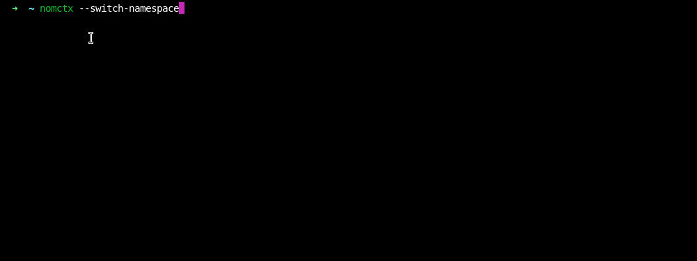
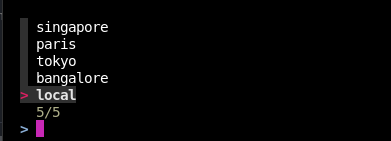
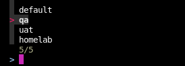

<a href="https://zerodha.tech"></a>

# nomctx

Faster way to switch between [Nomad](https://www.nomadproject.io/) clusters and namespaces. Inspired from [kubectx](https://github.com/ahmetb/kubectx/).




## Why was this created

If you're operating multiple Nomad clusters, switching between these clusters is a cumbersome task of exporting variables in shell. Ideally `nomad`, should use a file similar to `~/.kube/config` for authenticating against multiple clusters as described in this [issue](https://github.com/hashicorp/nomad/issues/11043). Since this feature isn't available as of yet, I've created `nomctx` which can emit the [environment-variables](https://www.nomadproject.io/docs/commands#environment-variables) required by `nomad` CLI for authentication.

## Installation

Grab the latest release from [Releases](https://github.com/mr-karan/nomctx/releases).

To run:

```bash
$ nomctx
```

By default `nomctx` searches for the file in `~/.nomctx/config.hcl` but you can override that with `--config=</path/to/config.hcl>` flag.


## Usage

```bash
nomctx --help  

      --config string          Path to a config file to load. (default "~/.nomctx/config.hcl")
      --list-clusters          List all clusters
      --list-namespaces        List all namespaces
      --set-cluster string     Set cluster
      --set-namespace string   Set namespace
      --switch-cluster         Switch cluster (default true)
      --switch-namespace       Switch namespace
  -v, --version                Show version of nomctx
```

### Interactive Mode

If you have [`fzf`](https://github.com/junegunn/fzf) installed, the tool will show an interactive prompt for switching `clusters` or `namespace`.






### Non Interactive Mode

If you don't have `fzf`, you can use switch manually with `set-cluster=<>` and `set-namespace=<>` commands.

#### List all clusters

```bash
nomctx --list-clusters
local
bangalore
tokyo
paris
singapore
```

#### List all namespaces

```bash
nomctx --list-namespaces
homelab
uat
qa
default
```

#### Set a cluster

```bash
nomctx --set-cluster=bangalore
export NOMAD_ADDRESS=http://10.0.0.1:4646
export NOMAD_TOKEN=f8cb5774-749a-4548-acc9-054df3b52e83
export NOMAD_HTTP_AUTH=user:pass
export NOMAD_NAMESPACE=pink
```

#### Set a namespace

```bash
nomctx --set-namespace=uat    
export NOMAD_NAMESPACE=uat
```

### Set variables on shell

You can use `eval` to directly set the environment variables on shell. This works with both the interactive and non-interactive modes.

For eg, to switch a cluster in interactive mode **and** set the env vars on shell:

```bash
eval $(nomctx)

# You can see the env variables are automatically exported on shell.
env | grep NOMAD_
NOMAD_ADDRESS=http://10.0.0.1:4646
NOMAD_TOKEN=c0a7d714-46df-4c6e-954a-269578c3804d
NOMAD_NAMESPACE=pink
NOMAD_HTTP_AUTH=user:pass
NOMAD_REGION=paris
```

## Configuration

Here's a sample config file which shows 2 clusters: `dev` and `prod`:

```hcl
clusters "dev" {
  address   = "http://127.0.0.1:4646"
  namespace = "default"
}

clusters "prod" {
  address   = "http://10.0.0.3:4646"
  namespace = "blue"
  region    = "blr"
  token     = "f8cb5774-749a-4548-acc9-054df3b52e83"
}
```

## LICENSE

See [LICENSE](./LICENSE)
